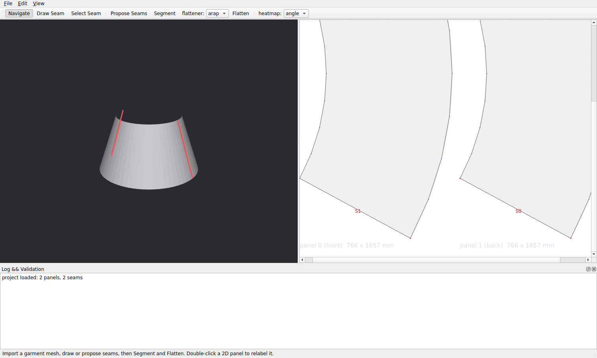

# SeamForge Reverse

Reconstruct the 2D construction pattern pieces from which a completed 3D
garment could have been made.

```
3D garment mesh → validation → seam curves (drawn / proposed with confidence)
→ cut into panels (exact 3D↔2D correspondence) → distortion-aware flattening
(LSCM / ARAP) → deterministic seam pairing → editable, regularised 2D panels
→ SVG / DXF / JSON project
```

Original code built on public research and permissively licensed
libraries — no proprietary garment-CAD code, assets or formats.



## Status

The reference milestone — **two-panel skirt reverse reconstruction** —
works end-to-end (CLI and GUI) and is covered by 32 automated tests.
Measured on the developable benchmark skirt: 0 flipped triangles, mean
angle distortion 1.0000, seam-length mismatch ~1e-7 %, lossless project
round-trip, IoU 1.0 automatic segmentation. See ROADMAP.md for stage
status and KNOWN_LIMITATIONS.md for the honest gap list.

## Build

Dependencies (Ubuntu 24.04):
```bash
apt install cmake ninja-build g++ qt6-base-dev libqt6opengl6-dev \
    libeigen3-dev libassimp-dev catch2 nlohmann-json3-dev libgl1-mesa-dev
```

```bash
cmake -S . -B build -G Ninja      # GUI skipped automatically if Qt6 absent
cmake --build build
ctest --test-dir build            # 32 tests
```

## Quick start (headless)

```bash
build/src/tools/make-test-meshes data/meshes      # benchmark skirts + ground truth

build/src/tools/seamforge-cli pipeline \
  --mesh  data/meshes/skirt_simple.obj \
  --seams data/meshes/skirt_simple.seams.json \
  --out   out/skirt --flattener arap \
  --project out/skirt/skirt.sfrproj --heatmap
# → pattern.svg, pattern.dxf, panel OBJs, metrics.json, project file

build/src/tools/seamforge-cli auto \
  --mesh data/meshes/skirt_simple.obj \
  --truth data/meshes/skirt_simple.gt.json --out out/auto   # IoU vs ground truth

build/src/tools/seamforge-cli match \
  --mesh data/meshes/skirt_precut.obj --out out/precut   # pre-cut panels:
                                    # boundary-matched seam proposals

bash experiments/run_all.sh       # experiments 1-5
```

## GUI

```bash
build/src/app/seamforge
```
Import a mesh (File → Import), draw seams on the surface (Draw Seam:
click vertices, Enter commits; paths snap to shortest edge paths) or use
Propose Seams (candidates are colour-coded by confidence), then Segment
→ Flatten → export SVG/DXF or save the `.sfrproj` project. Double-click
a 2D panel to relabel it; drag boundary control points; Edit → Undo/Redo
throughout.

## Documentation

| File | Content |
|---|---|
| ARCHITECTURE.md | pipeline, modules, interfaces, design decisions |
| RESEARCH.md | literature review with per-method suitability |
| ALGORITHM_COMPARISON.md | decision tables + measured numbers |
| DATA_MODELS.md | in-memory types and the `.sfrproj` schema |
| ROADMAP.md | stage status and next priorities |
| TEST_STRATEGY.md | acceptance criteria, benchmark, metrics |
| KNOWN_LIMITATIONS.md | what does not work yet, honestly |
| DECISION_LOG.md | why things are the way they are |
| AGENTS.md / CONTINUATION_GUIDE.md | for the next contributor (human or agent) |
| experiments/README.md | experiments 1-4 with measured results |

## Licence notes on dependencies
Eigen (MPL2), Assimp (BSD-3), nlohmann/json (MIT), Catch2 (BSL-1.0),
Qt 6 (LGPLv3, dynamically linked). Algorithms (LSCM, ARAP,
Douglas-Peucker, XPBD plans) implemented natively from the published
papers.
